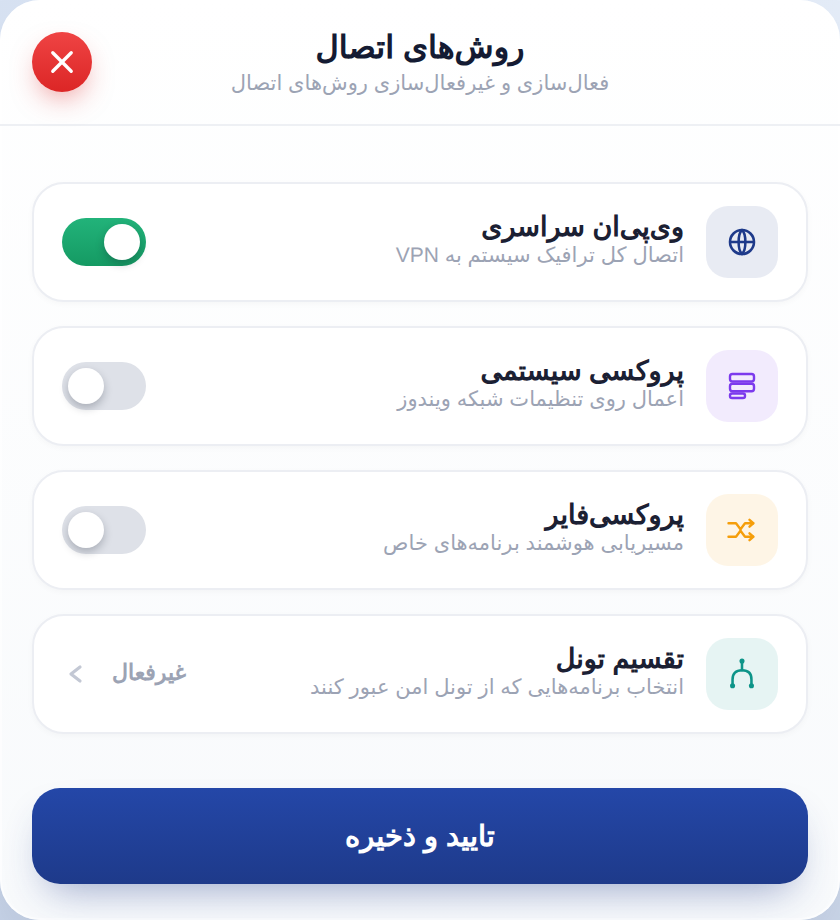
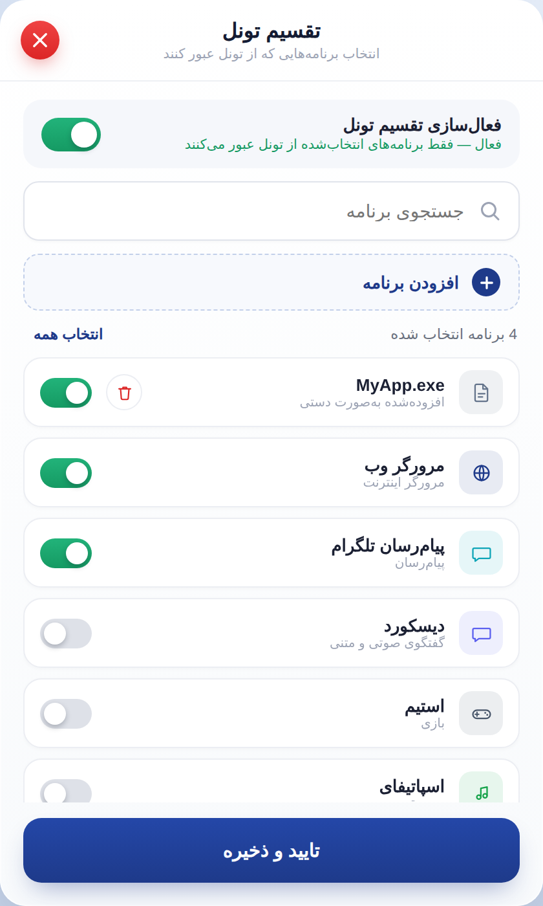
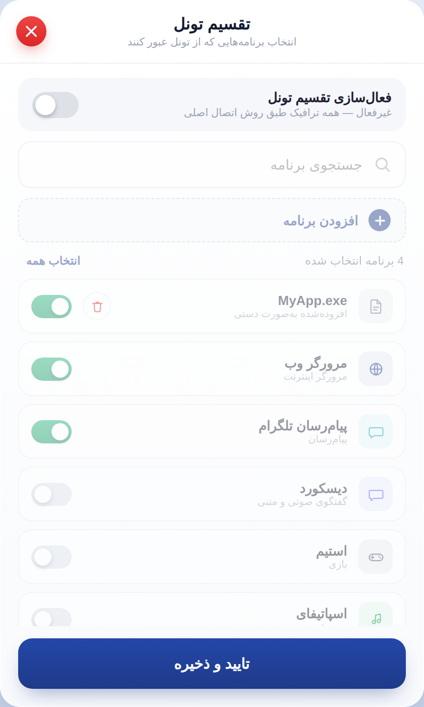

# راهنمای پیاده‌سازی WPF — «روش‌های اتصال» و «تقسیم تونل»

پلتفرم: WPF روی .NET 8 (`net8.0-windows`)، الگوی MVVM
فایل‌های طراحی مرجع: `design-source/SettingsConnectionMethods.dc.html` و `design-source/SettingsSplitTunnelApps.dc.html`
تصاویر مرجع: پوشه `screenshots/` (با کیفیت ۲ برابر)

> **مهم — وضعیت کد:** پروژه WPF داخل این بسته کامل نوشته شده، ولی در محیط ما (بدون ویندوز و .NET) **build و اجرا نشده است**. XAMLها از نظر ساختار XML و کلیدهای Resource بررسی شده‌اند و همه Bindingها به Propertyهای موجود در ViewModel وصل‌اند، اما ممکن است هنگام اولین build در Visual Studio یک یا دو خطای جزئی دیده شود. لطفاً اول پروژه دمو را build و اجرا کنید و با تصاویر مرجع مقایسه کنید، بعد به اپ اصلی منتقل کنید.

---

## ۱. چه چیزی تغییر کرده (نسبت به نسخه قبلی طرح)

| تغییر | کجا |
|---|---|
| **کلید فعال/غیرفعال تقسیم تونل از صفحه «روش‌های اتصال» حذف شد** | روش‌های اتصال |
| ردیف «تقسیم تونل» حالا فقط یک ردیف ناوبری است: به‌جای کلید، وضعیت («فعال»/«غیرفعال») و فلش ورود نشان می‌دهد و با کلیک روی کل ردیف، صفحه تقسیم تونل باز می‌شود | روش‌های اتصال |
| **کلید «فعال‌سازی تقسیم تونل» به بالای صفحه تقسیم تونل منتقل شد** | تقسیم تونل |
| وقتی تقسیم تونل خاموش است، جستجو، دکمه افزودن، «انتخاب همه» و لیست برنامه‌ها **کم‌رنگ (۴۵٪) و غیرفعال** می‌شوند | تقسیم تونل |
| **دکمه «افزودن برنامه»** (خط‌چین) برای اضافه کردن دستی فایل `.exe` | تقسیم تونل |
| برنامه‌های افزوده‌شده به‌صورت دستی آیکون فایل، زیرعنوان «افزوده‌شده به‌صورت دستی» و **دکمه حذف (سطل قرمز)** دارند | تقسیم تونل |

---

## ۲. محتوای بسته

```
IRSPEEDY_ConnectionMethods_SplitTunnel_Guide.md   ← همین سند
screenshots/
  01-connection-methods.png
  02-split-tunnel-on.png
  03-split-tunnel-off.png
design-source/
  SettingsConnectionMethods.dc.html              ← مرجع هر عدد/رنگی که اینجا نیامده
  SettingsSplitTunnelApps.dc.html
wpf/IrSpeedy.Settings/                           ← پروژه دمو قابل اجرا
  IrSpeedy.Settings.csproj
  app.manifest                                    ← DPI: PerMonitorV2
  App.xaml / App.xaml.cs
  Fonts/                                          ← Vazirmatn (5 وزن Static) + OFL.txt
  Themes/
    Colors.xaml        ← همه رنگ‌ها
    Typography.xaml    ← فونت‌ها و استایل متن‌ها
    Icons.xaml         ← ۱۵ آیکون، تبدیل ۱:۱ از SVGهای طرح
    Controls.xaml      ← استایل دکمه‌ها، کلید، جستجو، کارت، اسکرول‌بار (بقیه را خودش merge می‌کند)
  Controls/ToggleSwitch.cs
  Infrastructure/ObservableObject.cs, RelayCommand.cs, BrushHelper.cs
  Models/ConnectionSettings.cs
  Services/ISettingsStore.cs, InMemorySettingsStore.cs (دمو)
  ViewModels/ConnectionMethodsViewModel.cs, ConnectionMethodItem.cs,
             SplitTunnelViewModel.cs, SplitTunnelAppItem.cs
  Views/ConnectionMethodsWindow.xaml(.cs), SplitTunnelWindow.xaml(.cs),
        ConnectionMethodTemplateSelector.cs
```

### اجرای دمو
1. `wpf/IrSpeedy.Settings/IrSpeedy.Settings.csproj` را در Visual Studio 2022 باز کنید.
2. Run. پنجره «روش‌های اتصال» باز می‌شود؛ کلیک روی ردیف «تقسیم تونل» صفحه دوم را به‌صورت Dialog باز می‌کند.
3. داده‌ها از `InMemorySettingsStore` می‌آیند و دقیقاً همان داده‌های طرح هستند.

### انتقال به اپ اصلی
1. پوشه‌های `Themes`، `Controls`، `Views`، `ViewModels`، `Models`، `Services`، `Infrastructure` را کپی کنید و namespace را به namespace پروژه خودتان تغییر دهید.
2. در `Controls.xaml` و `App.xaml` مسیر `/IrSpeedy.Settings;component/...` را به نام Assembly اپ خودتان عوض کنید.
3. `Controls.xaml` را در `App.xaml` اپ merge کنید (بقیه dictionaryها را خودش merge می‌کند).
4. یک پیاده‌سازی واقعی از `ISettingsStore` بنویسید (بخش ۶) و به‌جای `InMemorySettingsStore` استفاده کنید.
5. اگر اپ از CommunityToolkit.Mvvm یا فریم‌ورک MVVM دیگری استفاده می‌کند، `ObservableObject` و `RelayCommand` را با معادل خودتان جایگزین کنید.
6. اگر اپ روی **.NET Framework** است (نه .NET 6/8)، `Nullable` و چند syntax جدید C# (مثل `?.Invoke`, `is ... &&`) را بررسی کنید؛ بقیه کد مستقل از نسخه است.

---

## ۳. قواعد مشترک (هر دو صفحه)

### پنجره
| مورد | مقدار |
|---|---|
| نوار عنوان ویندوز | ندارد — `WindowStyle="None"`, `AllowsTransparency="True"` |
| گوشه | ۲۰ |
| پس‌زمینه | گرادیان عمودی `#FFFFFF` → `#F8FAFC` |
| اندازه قابل تغییر | خیر (`ResizeMode="NoResize"`) |
| جابه‌جایی | با درگ روی هدر (`DragMove`) |
| جهت | `FlowDirection="RightToLeft"` روی Window |
| فونت پیش‌فرض | Vazirmatn |
| رندر متن | `TextFormattingMode="Display"`, `ClearType` |

همه این‌ها در استایل `IrsWindowStyle` (فایل `Controls.xaml`) هست؛ هر پنجره فقط `Style="{StaticResource IrsWindowStyle}"` می‌گیرد.

### هدر (۶۲ پیکسل)
- عنوان وسط‌چین: ۱۶، ExtraBold، `#141B33`
- زیرعنوان: ۱۰٫۵، Medium، `#9CA3B4`
- خط زیر هدر: ۱px `#EEF0F4`
- دکمه بستن: دایره قرمز ۳۰ پیکسلی با گرادیان `#EF4444` → `#DC2626`، ضربدر سفید ۱۲، سایه قرمز؛ **سمت چپِ فیزیکی، ۱۶ پیکسل از لبه**؛ hover بزرگ‌تر (۱٫۰۶)

### نکات راست‌به‌چپ در WPF (خیلی مهم)
- در پنجره RTL، ستون ۰ از `Grid` **سمت راست فیزیکی** است و `HorizontalAlignment="Right"` یعنی **سمت چپ فیزیکی**. `Margin` چپ/راست هم آینه می‌شود.
- **WPF در درخت RTL، Path و Shapeها را آینه می‌کند.** برای همین در `Icons.xaml` روی `Viewbox` هر آیکون `FlowDirection="LeftToRight"` گذاشته شده. اگر این را حذف کنید، فلش‌ها و آیکون‌هایی مثل «پروکسی‌فایر»، «موسیقی» و «پیام‌رسان» برعکس رسم می‌شوند.
- کلید (ToggleSwitch) همیشه `LeftToRight` است: روشن = دایره سمت راست، مثل طرح.
- برای فاصله بین المان‌ها کنار کلیدها از ستون‌های خالی `Grid` استفاده شده، نه Margin روی خود کلید (چون جهت کلید LTR است و Margin آن با بقیه ردیف قاطی می‌شود).

### کلید روشن/خاموش — `Controls/ToggleSwitch.cs`
| مورد | مقدار |
|---|---|
| ریل روشن | گرادیان `#22B37A` → `#159A63` |
| ریل خاموش | `#DEE1E8` |
| دایره | سفید، سایه `0 2 4 rgba(16,24,40,0.25)`، فاصله ۳ از لبه ریل |
| حرکت | ۱۵۰ms، ease-out |
| اندازه‌ها | ردیف‌های روش اتصال **۴۲×۲۴** · کلید فعال‌سازی تقسیم تونل **۴۶×۲۶** · ردیف برنامه‌ها **۴۰×۲۳** |

اندازه در محل استفاده با `Width`/`Height` داده می‌شود؛ اندازه و جابه‌جایی دایره را کلاس خودش حساب می‌کند.

### دکمه «تایید و ذخیره»
تمام‌عرض، گوشه ۱۴، گرادیان `#2447A8` → `#1E3A8A`، متن سفید ۱۴٫۵ Bold، سایه آبی؛ hover یک پیکسل بالا می‌رود. ارتفاع: **۴۸** در روش‌های اتصال، **۵۰** در تقسیم تونل.

### فونت
پنج فایل Static در `Fonts/` با Build Action = **Resource**. برای وزن‌های ۵۰۰، ۶۰۰ و ۸۰۰ **حتماً** نام داخلی جدا استفاده شود (در `Typography.xaml` آماده است):

| وزن | FontFamily |
|---|---|
| 400 | `#Vazirmatn` |
| 500 | `#Vazirmatn Medium` |
| 600 | `#Vazirmatn SemiBold` |
| 700 | `#Vazirmatn` + `FontWeight="Bold"` |
| 800 | `#Vazirmatn ExtraBold` |

اگر روی سیستمی یکی از وزن‌های Medium / SemiBold / ExtraBold مثل Regular دیده شد، روش جایگزین: `FontFamily="#Vazirmatn"` همراه با `FontWeight="Medium"` / `"SemiBold"` / `"ExtraBold"`.

### DPI
`app.manifest` با `PerMonitorV2`. بدون آن در مقیاس ۱۲۵٪ پنجره ۴۲۰×۷۰۰ به ۵۲۸×۸۷۶ کشیده و تار می‌شود.

---

## ۴. صفحه «روش‌های اتصال» — `Views/ConnectionMethodsWindow.xaml`



**اندازه: ۴۲۰ × ۴۶۰** (استثنا — چون فقط ۴ ردیف دارد)

### چیدمان
- هدر: «روش‌های اتصال» / «فعال‌سازی و غیرفعال‌سازی روش‌های اتصال»
- ناحیه ردیف‌ها: padding ۱۶، فاصله بین ردیف‌ها ۱۲، **ردیف‌ها عمودی وسط‌چین**
- پایین: دکمه تایید و ذخیره (padding ۱۶ چپ‌وراست، ۱۸ پایین)

### کارت هر ردیف
| مورد | مقدار |
|---|---|
| حداقل ارتفاع | ۶۰ |
| padding | ۱۰ بالا/پایین، ۱۴ چپ/راست |
| گوشه | ۱۶ |
| پس‌زمینه / حاشیه | سفید / ۱px `#ECEEF3` |
| hover | حاشیه `#D8DCE6`، سایه قوی‌تر، ۱ پیکسل بالا |

محتوا از راست به چپ: **نشان آیکون** (۳۶×۳۶، گوشه ۱۱، پس‌زمینه = رنگ آیکون با ۱۰٪ شفافیت، آیکون ۱۸) ← فاصله ۱۱ ← **عنوان** (۱۳٫۵ Bold) و **زیرعنوان** (۱۰٫۵، `#9CA3B4`) ← فاصله ۱۱ ← **کنترل سمت چپ**

### ردیف‌ها

| # | عنوان | زیرعنوان | آیکون / رنگ | سمت چپ ردیف |
|---|---|---|---|---|
| ۱ | وی‌پی‌ان سراسری | اتصال کل ترافیک سیستم به VPN | Globe / `#1E3A8A` | کلید ۴۲×۲۴ (پیش‌فرض روشن) |
| ۲ | پروکسی سیستمی | اعمال روی تنظیمات شبکه ویندوز | Stack / `#7C3AED` | کلید ۴۲×۲۴ |
| ۳ | پروکسی‌فایر | مسیریابی هوشمند برنامه‌های خاص | Route / `#F59E0B` | کلید ۴۲×۲۴ |
| ۴ | تقسیم تونل | انتخاب برنامه‌هایی که از تونل امن عبور کنند | Split / `#0D9488` | **بدون کلید:** متن وضعیت + فلش `<` |

### ردیف ۴ — تقسیم تونل (ناوبری)
- متن وضعیت: «فعال» (سبز `#159A63`) یا «غیرفعال» (خاکستری `#9CA3B4`)، ۱۱، SemiBold
- فلش: ۱۴×۱۴، رنگ `#C3C8D4`، رو به **چپ** (یعنی «جلو» در RTL)
- **کل کارت یک Button است** (`CardButtonStyle`) و با کلیک یا Enter/Space صفحه تقسیم تونل را به‌صورت Dialog باز می‌کند.
- بعد از بسته شدن صفحه تقسیم تونل، `RefreshSplitTunnelStatus()` صدا زده می‌شود تا متن وضعیت با مقدار ذخیره‌شده به‌روز شود.
- وضعیت تقسیم تونل **فقط** در صفحه خودش تغییر می‌کند؛ دکمه «تایید و ذخیره» این صفحه آن را بازنویسی نمی‌کند.

### رفتار
- کلیدهای ۱ تا ۳ فقط در حافظه عوض می‌شوند؛ با «تایید و ذخیره» ذخیره و پنجره بسته می‌شود.
- دکمه بستن بدون ذخیره می‌بندد.

> **تصمیم محصول لازم:** در طرح مشخص نیست که روش‌های ۱ تا ۳ هم‌زمان می‌توانند روشن باشند یا فقط یکی. کد فعلی آن‌ها را مستقل نگه می‌دارد. اگر فقط یکی مجاز است، در `ConnectionMethodsViewModel` (کامنت `TODO(product)`) با روشن شدن یکی، بقیه خاموش شوند.

---

## ۵. صفحه «تقسیم تونل» — `Views/SplitTunnelWindow.xaml`

| روشن | خاموش |
|---|---|
|  |  |

**اندازه: ۴۲۰ × ۷۰۰** (استاندارد). به‌صورت Dialog روی پنجره روش‌های اتصال باز می‌شود (`Owner` + `ShowDialog`، وسط پنجره والد).

### چیدمان (از بالا به پایین)
هدر «تقسیم تونل» / «انتخاب برنامه‌هایی که از تونل عبور کنند» ← محتوا با padding ۱۴ بالا و ۱۸ چپ‌وراست، فاصله بخش‌ها ۱۰:

1. **ردیف فعال‌سازی** (همیشه فعال)
2. **کادر جستجو** ┐
3. **دکمه «افزودن برنامه»** │ ← این ۴ بخش وقتی تقسیم تونل خاموش است
4. **شمارنده + «انتخاب همه»** │    Opacity = 0.45 و IsEnabled = false
5. **لیست برنامه‌ها** (اسکرول) ┘

و پایین: دکمه تایید و ذخیره (padding ۱۲ بالا، ۱۸ بقیه).

### ۵.۱ ردیف فعال‌سازی
| مورد | مقدار |
|---|---|
| پس‌زمینه | `#F5F7FB`، گوشه ۱۴، padding ۱۲×۱۴ |
| عنوان | «فعال‌سازی تقسیم تونل» — ۱۳ Bold |
| وضعیت (روشن) | «فعال — فقط برنامه‌های انتخاب‌شده از تونل عبور می‌کنند» — سبز `#159A63` |
| وضعیت (خاموش) | «غیرفعال — همه ترافیک طبق روش اتصال اصلی» — `#9CA3B4` |
| کلید | ۴۶×۲۶، سمت چپ |

### ۵.۲ جستجو
۴۴ ارتفاع، گوشه ۱۲، حاشیه `#E1E4EC`، آیکون ذره‌بین ۱۶ سمت راست، placeholder «جستجوی برنامه». در حالت فوکوس، حاشیه آبی `#1E3A8A` با هاله ملایم.
**رفتار:** فیلتر زنده روی نام و دسته‌بندی برنامه (بدون حساسیت به حروف بزرگ/کوچک).

### ۵.۳ دکمه «افزودن برنامه» (جدید)
| مورد | مقدار |
|---|---|
| ارتفاع | ۴۴، گوشه ۱۲ |
| قاب | **خط‌چین** ۱٫۵px رنگ `#C3D0EA`، پس‌زمینه `#F7F9FD` |
| hover | پس‌زمینه `#EEF3FC`، خط‌چین `#A9BCE3` |
| محتوا (از راست) | دایره آبی ۲۲ با «+» سفید ← فاصله ۱۰ ← متن **«افزودن برنامه»** (۱۳ Bold، آبی) |

چون `Border` در WPF خط‌چین ندارد، قاب با `Rectangle` و `StrokeDashArray="4 3"` ساخته شده (`AddButtonStyle`).

**رفتار:**
1. پنجره انتخاب فایل ویندوز باز می‌شود (فیلتر: `*.exe`، یک فایل).
2. اگر همان مسیر قبلاً در لیست باشد، ردیف تکراری ساخته نمی‌شود؛ فقط کلید همان ردیف روشن می‌شود.
3. در غیر این صورت ردیف جدید **اول لیست** اضافه می‌شود با:
   - نام = نام فایل (مثلاً `MyApp.exe`)
   - زیرعنوان = «افزوده‌شده به‌صورت دستی»
   - آیکون فایل، رنگ `#64748B`
   - کلید **روشن**
   - دکمه حذف
4. متن جستجو پاک می‌شود تا ردیف جدید دیده شود.

### ۵.۴ شمارنده و «انتخاب همه»
- راست: «N برنامه انتخاب شده» (۱۱٫۵، `#6B7280`). N = تعداد **همه** برنامه‌های روشن، نه فقط برنامه‌های دیده‌شده در جستجو.
- چپ: «انتخاب همه» (۱۱٫۵ Bold، آبی) ← همه برنامه‌های **دیده‌شده** (بعد از فیلتر جستجو) را روشن می‌کند.

### ۵.۵ لیست برنامه‌ها
اسکرول عمودی، اسکرول‌بار باریک ۶px (`#D7DBE3`)، فاصله بین کارت‌ها ۸.

**کارت برنامه:** padding ۹×۱۲، گوشه ۱۴، سفید، حاشیه `#ECEEF3`، hover حاشیه `#D8DCE6`.
محتوا از راست به چپ:
نشان آیکون (۳۴×۳۴، گوشه ۱۰، رنگ برنامه با ۱۰٪ شفافیت، آیکون ۱۷) ← ۱۱ ← نام (۱۳ Bold) و دسته (۱۰، `#9CA3B4`) ← [فقط برنامه دستی: ۱۱ + **دکمه حذف**] ← ۱۱ ← کلید ۴۰×۲۳

**دکمه حذف:** دایره ۲۸، سفید، حاشیه `#ECEEF3`، آیکون سطل قرمز `#DC2626` سایز ۱۳؛ hover پس‌زمینه `#FDECEC`. فقط روی برنامه‌های افزوده‌شده دستی. **برنامه‌های پیش‌فرض قابل حذف نیستند.**

**داده نمونه طرح:**

| نام | دسته | آیکون | رنگ | روشن |
|---|---|---|---|---|
| MyApp.exe *(دستی)* | افزوده‌شده به‌صورت دستی | File | `#64748B` | ✓ |
| مرورگر وب | مرورگر اینترنت | Globe | `#1E3A8A` | ✓ |
| پیام‌رسان تلگرام | پیام‌رسان | Chat | `#0EA5B7` | ✓ |
| دیسکورد | گفتگوی صوتی و متنی | Chat | `#5B5FEF` | |
| استیم | بازی | Game | `#475569` | |
| اسپاتیفای | موسیقی | Music | `#16A34A` | |
| آوت‌لوک | ایمیل | Mail | `#2563EB` | ✓ |
| زوم | تماس تصویری | Video | `#0369A1` | |

در اپ واقعی، لیست برنامه‌های پیش‌فرض باید از منبع واقعی بیاید (فهرست برنامه‌های نصب‌شده یا کاتالوگ خودتان). این جدول فقط برای دمو است.

### ۵.۶ ذخیره و بستن
- «تایید و ذخیره»: وضعیت فعال‌سازی + کل لیست (شامل برنامه‌های دستی و مسیر exe آن‌ها) ذخیره و Dialog با `DialogResult = true` بسته می‌شود.
- دکمه بستن: بدون ذخیره (`DialogResult = false`).

### ۵.۷ مواردی که در طرح نیست و در کد اضافه شده
- اگر جستجو نتیجه‌ای نداشت: متن خاکستری «برنامه‌ای پیدا نشد» بالای ناحیه لیست.
- جلوگیری از اضافه شدن exe تکراری.
- حلقه فوکوس کیبورد (آبی کم‌رنگ) روی دکمه‌ها و کلیدها برای دسترسی‌پذیری.

---

## ۶. اتصال به منطق واقعی — `Services/ISettingsStore.cs`

صفحه‌ها فقط از این رابط استفاده می‌کنند:

```csharp
public interface ISettingsStore
{
    ConnectionSettings Load();              // هر بار یک نسخه تازه برگرداند
    void Save(ConnectionSettings settings); // فقط با «تایید و ذخیره» صدا زده می‌شود
}
```

`ConnectionSettings`:

| فیلد | معنی |
|---|---|
| `GlobalVpn` | وی‌پی‌ان سراسری |
| `SystemProxy` | پروکسی سیستمی |
| `Proxifier` | پروکسی‌فایر |
| `SplitTunnelEnabled` | تقسیم تونل روشن/خاموش (**فقط** صفحه تقسیم تونل می‌نویسد) |
| `SplitTunnelApps` | لیست برنامه‌ها: `Name`, `Category`, `IconKey`, `ColorHex`, `IsSelected`, `IsCustom`, `ExePath` |

**نکات پیاده‌سازی واقعی:**
- هسته VPN ترافیک برنامه‌ها را با **مسیر exe** تشخیص می‌دهد؛ برای برنامه‌های پیش‌فرض هم `ExePath` واقعی (یا نام پروسس) را پر کنید.
- وقتی `SplitTunnelEnabled = false` است، `IsSelected` برنامه‌ها حفظ می‌شود (فقط اعمال نمی‌شود)، تا با روشن کردن دوباره، انتخاب‌های قبلی برگردند.
- اگر تغییر تنظیمات هنگام اتصال فعال نیاز به اتصال مجدد دارد، بعد از `Save` این کار را انجام دهید یا به کاربر اطلاع دهید (در طرح پیامی برای این کشیده نشده).

---

## ۷. آیکون‌ها — `Themes/Icons.xaml`

۱۵ آیکون (Globe, Stack, Route, Split, Chat, Game, Music, Mail, Video, File, Trash, Plus, Search, Close, ChevronBack) با همان مختصات، ضخامت خط و گوشه‌های SVGهای طرح، به‌صورت `ControlTemplate`. دایره‌ها و مستطیل‌ها به Path تبدیل شده‌اند تا خط دقیقاً روی مرز بیفتد (مثل SVG)؛ `Ellipse` و `Rectangle` در WPF خط را داخل مرز می‌کشند و آیکون نیم پیکسل جابه‌جا می‌شود.

```xml
<!-- آیکون ثابت -->
<Control Template="{StaticResource Icon.Plus}" Foreground="White" Width="11" Height="11"/>

<!-- آیکون از روی داده (IconKey در ViewModel) -->
<Control Style="{StaticResource DataIconStyle}" Foreground="{Binding AccentBrush}" Width="17" Height="17"/>
```

رنگ آیکون همیشه از `Foreground` می‌آید.

---

## ۸. چک‌لیست تست (QA)

**روش‌های اتصال**
- [ ] پنجره ۴۲۰×۴۶۰ است (در مقیاس ۱۰۰٪ و ۱۲۵٪ ویندوز) و متن‌ها تار نیستند.
- [ ] ردیف «تقسیم تونل» **کلید ندارد**؛ متن وضعیت و فلش `<` دارد.
- [ ] کلیک روی هر جای ردیف تقسیم تونل، صفحه تقسیم تونل را باز می‌کند؛ با کیبورد (Tab + Enter) هم کار می‌کند.
- [ ] بعد از روشن کردن و ذخیره در صفحه تقسیم تونل، متن ردیف به «فعال» سبز تغییر می‌کند.
- [ ] «تایید و ذخیره» این صفحه وضعیت تقسیم تونل را عوض نمی‌کند.
- [ ] آیکون «پروکسی‌فایر» (فلش‌ها) برعکس رسم نشده است.

**تقسیم تونل**
- [ ] پنجره ۴۲۰×۷۰۰ است و وسط پنجره والد باز می‌شود.
- [ ] کلید فعال‌سازی بالای صفحه است و متن وضعیت با آن عوض می‌شود.
- [ ] با خاموش کردن، همه بخش‌های زیر آن کم‌رنگ و غیرقابل‌کلیک می‌شوند.
- [ ] «افزودن برنامه» پنجره انتخاب فایل را فقط با فیلتر exe باز می‌کند.
- [ ] برنامه اضافه‌شده اول لیست، روشن، با آیکون فایل و دکمه حذف ظاهر می‌شود.
- [ ] افزودن دوباره همان exe ردیف تکراری نمی‌سازد.
- [ ] دکمه حذف فقط روی برنامه‌های دستی هست و کار می‌کند.
- [ ] جستجو لیست را فیلتر می‌کند؛ «انتخاب همه» فقط برنامه‌های دیده‌شده را روشن می‌کند.
- [ ] شمارنده «N برنامه انتخاب شده» با هر تغییر کلید به‌روز می‌شود.
- [ ] اسکرول‌بار باریک است و روی کارت‌ها نمی‌افتد.
- [ ] بستن بدون ذخیره، تغییرات را دور می‌ریزد.

**مشترک**
- [ ] کلیدها: روشن = دایره سمت راست، انیمیشن نرم ۱۵۰ms.
- [ ] فونت Vazirmatn با وزن‌های درست (نه فونت جایگزین سیستم).
- [ ] دکمه بستن قرمز سمت چپ هدر است؛ پنجره با درگ هدر جابه‌جا می‌شود.
- [ ] مقایسه نهایی با تصاویر پوشه `screenshots/`.
